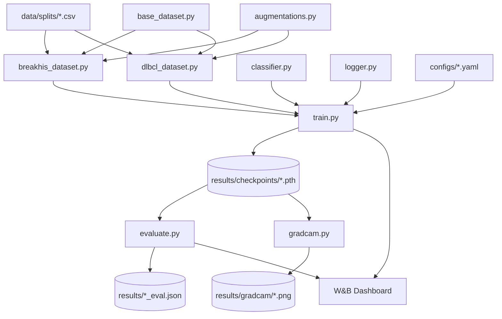

# architecture.md — 系统结构

> 接口细节见 [protocol.md](protocol.md)，运行环境见 [environment.md](environment.md)

## 1. 文件与文件夹结构

```
project/
├── data/
│   ├── breakhis/               # 原始图像，仅40×（不纳入git）
│   ├── dlbcl/                  # 原始图像（不纳入git）
│   └── splits/                 # CSV train/test splits（纳入git）
│       ├── breakhis_train.csv
│       ├── breakhis_test.csv
│       ├── dlbcl_train.csv
│       └── dlbcl_test.csv
│
├── src/
│   ├── datasets/
│   │   ├── base_dataset.py     # 抽象基类
│   │   ├── breakhis_dataset.py # BreaKHis子类
│   │   └── dlbcl_dataset.py    # DLBCL子类（含patch聚合）
│   ├── models/
│   │   ├── classifier.py       # EfficientNet-B2封装
│   │   └── gradcam.py          # GradCAM热力图生成
│   ├── training/
│   │   ├── train.py            # 通用训练循环（AMP）
│   │   └── evaluate.py         # 评估输出JSON
│   └── utils/
│       ├── augmentations.py    # 数据增强配置
│       └── logger.py           # W&B封装
│
├── configs/
│   ├── breakhis.yaml
│   └── dlbcl.yaml
│
├── notebooks/
│   ├── eda_breakhis.ipynb
│   └── eda_dlbcl.ipynb
│
├── results/                    # 输出图表和JSON（不纳入git）
├── requirements.txt
├── .gitignore
├── PRD.md
├── architecture.md
├── protocol.md
└── environment.md
```

## 2. 模块职责

| 模块 | 职责 |
|------|------|
| `base_dataset.py` | 定义所有Dataset子类必须实现的抽象接口和统一返回格式 |
| `breakhis_dataset.py` | 读取BreaKHis CSV和40×图像，返回标准样本字典 |
| `dlbcl_dataset.py` | 读取DLBCL CSV和图像patches，实现patient-level聚合逻辑 |
| `classifier.py` | 封装EfficientNet-B2，支持二分类fine-tune和特征提取 |
| `gradcam.py` | 对指定图像运行GradCAM，输出热力图叠加PNG |
| `train.py` | 读取YAML配置，执行带AMP的训练循环，记录到W&B |
| `evaluate.py` | 加载模型checkpoint，输出Accuracy/AUC/F1/混淆矩阵JSON |
| `augmentations.py` | 统一定义train/val两套transform，两个dataset共用 |
| `logger.py` | 封装W&B init/log/finish，隔离外部依赖 |
| `configs/*.yaml` | 存储超参数，实验员（C/D）直接修改此处，不动代码 |

## 3. 状态存储位置

| 数据 | 存储位置 |
|------|----------|
| 原始图像 | 本地文件系统 `data/` |
| train/test split | `data/splits/*.csv`（git托管） |
| 模型权重（checkpoint） | `results/checkpoints/*.pth`（本地，不入git） |
| 训练曲线、指标 | W&B云端dashboard |
| 评估结果 | `results/{dataset}_eval.json` |
| GradCAM输出图 | `results/gradcam/*.png` |
| 运行时batch tensor | GPU显存（临时，训练结束释放） |
| 预训练权重 | `~/.cache/torch/hub/`（timm自动缓存） |

## 4. 模块调用关系



## 5. 关键设计决策

| 决策 | 选择 | 理由 |
|------|------|------|
| 分类backbone | EfficientNet-B2（timm） | 8GB显存下B2是精度/显存最优点；B4+ OOM风险高 |
| 放大倍数 | 仅40× | 单倍数数据量可控，单epoch < 5min；多倍数ensemble超出时间约束 |
| 分割策略 | GradCAM弱监督 | BreaKHis无pixel-level mask，有监督分割无法训练；GradCAM合法且可量化展示 |
| 训练精度 | AMP混合精度 | FP16将有效batch size翻倍，不牺牲收敛精度 |
| 配置管理 | YAML文件 | 实验员（C/D）可直接修改超参数，无需改代码，防止代码污染 |
| 实验追踪 | W&B | 6人共享dashboard，免运维，优于本地MLflow |
| DLBCL聚合 | patient-level max pooling | 同一患者的patches取预测概率最大值，简单有效，优于mean（对异质性patch更敏感） |
